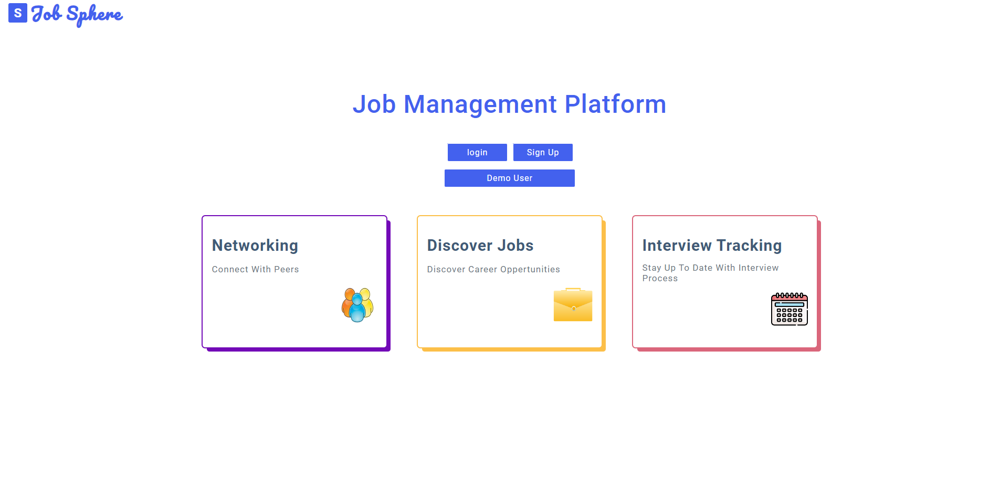

# JobSphere
### Website is live at https://ahmadjobsphere-h4rd.onrender.com

<!-- This project was built to streamline job search and track interview process. Frontend was implemented through react. Backend is written in flask and SQLalchemy. It also utitilizes boto3 SDK to interact with AWS.  -->
JobSphere is a platform to streamline job search and track interview progress. With an intuitive user interface and a range of features, it makes it easier to find latest and manage job search.

## Table of Contents

- [Installation](#installation)
- [Usage](#usage)

## Installation 

To get started with JobSphere, follow these steps:

1. **Clone or fork the project.**
2. **Run 'pipenv install' in the root directory to install server dependecies.** 
3. **Run 'npm install' to install frontend dependencies.**
4. **Run 'pipenv run flask db migrate' and 'pipenv run flask seed all' to add the mock data.**
5. **Run 'pipenv run flask run in the root depsoitory'.**
6. **Run 'npm start' in the react-app folder.**

## Usage

### Interviews

1. **Logged in user can create new interviews.**
3. **Logged in user can view interviews.**
2. **Logged in user can edit interviews.**
4. **Logged in user can delete interviews**

### Favorite Lists

1. **Logged in user can create new favorite lists.**
3. **Logged in user can view favorite lists.**
2. **Logged in user can edit favorite lists.**
4. **Logged in user can delete favorite lists**

### Interview Comments

1. **Logged in user can create new comments for an interview.**
3. **Logged in user can view comments.**
2. **Logged in user can edit comments.**
4. **Logged in user can delete comments**

### Jobs

1. **Logged in user can add jobs to favorite lists.**
3. **Logged in user can remove jobs favorite lists.**

### Profile 

1. **Logged in user can edit profile information, including profile picture.** 
